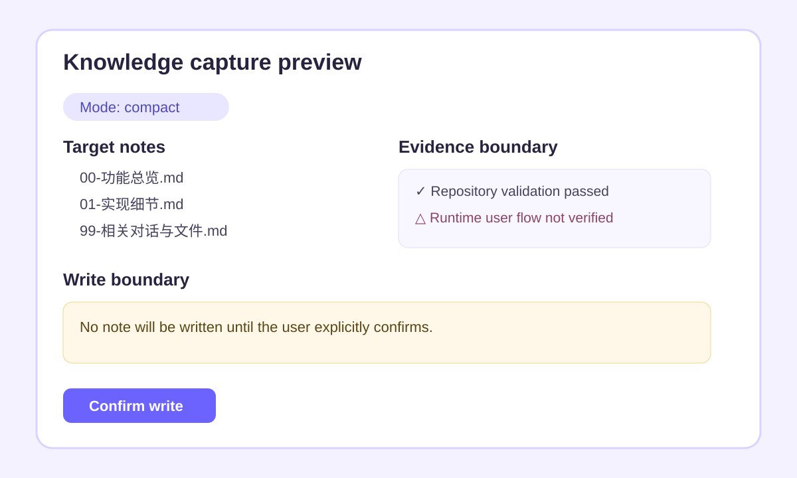

# Demo

The expected first interaction is a preview, not an immediate write.

```text
User: Use $code-knowledge-capture in compact mode to capture this fix. Preview only.

Codex preview:
- Project / feature / status
- Capture mode: compact
- capture_id, evidence_hash, source commit
- Notes to create or patch
- Facts, inferences, verification boundary, and redactions
- Notes intentionally omitted by compact mode
- Confirmation required before writing
```

After the user says `确认写入`, Codex validates paths, scans candidate Markdown,
writes through the connected Obsidian MCP, and reads the changed notes back.


